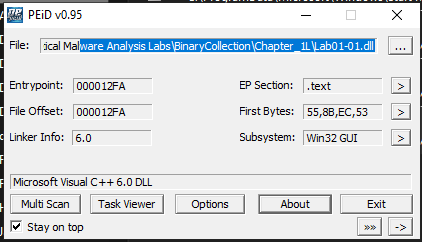
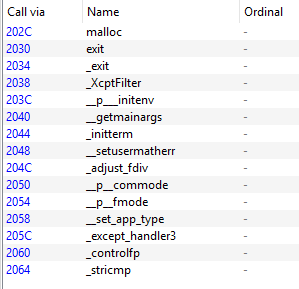

# Lab 1

## 1. Upload the files to http://www.VirusTotal.com/ and view the reports. Does either file match any existing antivirus signatures?

**lab01-01.dll**


**lab01-01.exe**


## 2. When were these files compiled?

Well using PE-bear, I was able to get the time the file is compiled.

**lab01-01.dll**


**lab01-01.exe**


## 3. Are there any indications that either of these files is packed or obfuscated? If so, what are these indicators?

Using PEiD the files seems to be not packed

**lab01-01.dll**



**lab01-01.exe**


## 4. Do any imports hint at what this malware does? If so, which imports are they?

 - lab01-01.exe
	 - KERNEL32.dll
		 - 
		 - This DLL file is quite common in most binary file. In this case, it mostly importing functions to create new files as well as finding certain files in the system.
	 - MSVCRT.dll
		 - 
		 - MSVCRT.dll is a standard library for Visual C++ which provides programs with most of the standard C library functions.
- lab01-01.dll
	- KERNEL32.dll
		- 
		- Quite similar to the exe file imports, but this time, mutex is involved in the imports.
		- A mutex object protects a shared resource from multiple access by threads and processes. Malware author uses this to make sure they do not reinfect an already infected system. 
	- WS2_32.dll
		- 
		- This linked library is used to handle network connections


## 5. Are there any other files or host-based indicators that you could look for on infected systems?  

A file is found when running **strings** with the DLL file named  Kernel123.dll. This "Kernel123.dll" file might be the file that will override the real KERNEL32 by disguising it. Besides that, the lab01-01.dll DLL file is also not a common system DLL file. We could use these files as an IOC to identify infected systems.


## 6. What network-based indicators could be used to find this malware on infected machines?

When using the **strings** command to get the strings in the lab01-01.dll file, it's found that the file will be communicating with a server host at ```127.26.152.13```. This could be our IOC in detecting the infection through network traffic sniffing and monitoring.

![[Pasted image 20220411212736.png]](network_IOC.png)

## 7. What would you guess is the purpose of these files?

These files most probably will create a backdoor in the victim's machine. Then, once the malware is executed, the malware will connect to a C2 server where further instruction is processed to the malware installed. For the malware to successfully exploit the system, it needs to replace the KERNEL32.dll with another malicious file. The WS2_32 library makes the network connections. The DLL file also utilized the sleep function, which stopped the execution of the malware. They will continue executing other commands after receiving the correct command from the C2 server.