# Lab 1

## Lab 01-01

### 1. Upload the files to http://www.VirusTotal.com/ and view the reports. Does either file match any existing antivirus signatures?

**lab01-01.dll**

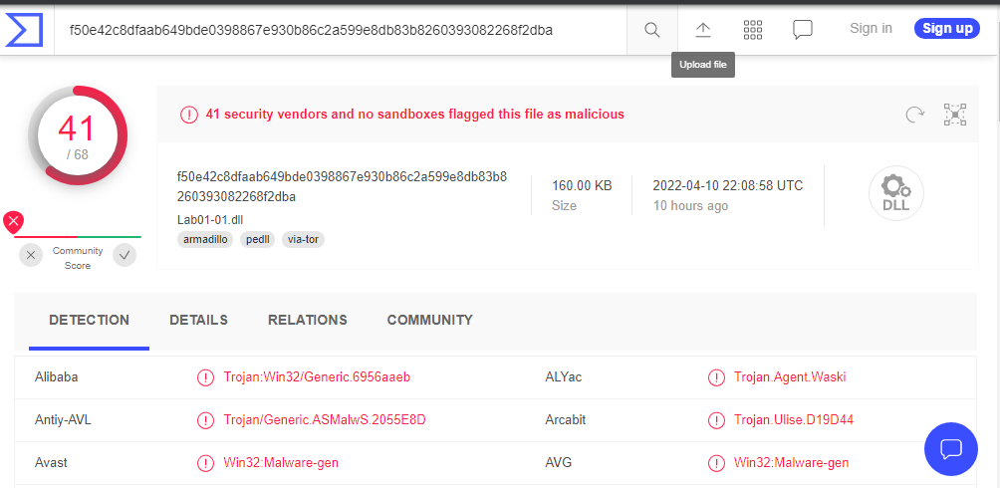

**lab01-01.exe**

### 2. When were these files compiled?

Using PE-bear, I was able to get the time the file is compiled.

**lab01-01.dll**

**lab01-01.exe**

### 3. Are there any indications that either of these files is packed or obfuscated? If so, what are these indicators?

Using PEiD, the files don't seem to be packed

**lab01-01.dll**

**lab01-01.exe**

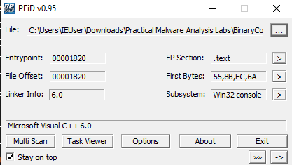

### 4. Do any imports hint at what this malware does? If so, which imports are they?

 - lab01-01.exe
	 - KERNEL32.dll
		 - 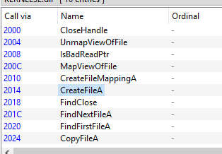
		 - This DLL file is quite common in many binary files. In this case, it mainly imports functions to create new files and find specific files in the system.
	 - MSVCRT.dll
		 - 
		 - MSVCRT.dll is a standard library for Visual C++, which provides programs with most of the standard C library functions.
- lab01-01.dll
	- KERNEL32.dll
		- 
		- Quite similar to the exe file imports, but this time, Mutex is involved in the imports.
		- A mutex object protects a shared resource from multiple access by threads and processes. Malware author uses this to make sure they do not reinfect an already infected system. 
	- WS2_32.dll
		- 
		- This linked library is used to handle network connections

### 5. Are there any other files or host-based indicators that you could look for on infected systems?  

A file is found when running **strings** with the DLL file named  Kernel132.dll. This "Kernel132.dll" file might be the file that will override the real KERNEL32 by disguising it. Besides that, the lab01-01.dll DLL file is also not a common system DLL file. We could use these files as an IOC to identify infected systems.

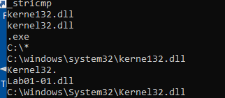

### 6. What network-based indicators could be used to find this malware on infected machines?

When using the **strings** command to get the strings in the lab01-01.dll file, it's found that the file will be communicating with a server host at "`127.26.152.13` ". This could be our IOC in detecting the infection through network traffic sniffing and monitoring.

### 7. What would you guess is the purpose of these files?

These files most probably will create a backdoor in the victim's machine. Then, once the malware is executed, the malware will connect to a C2 server where further instruction is processed to the malware installed. For the malware to successfully exploit the system, it needs to replace the KERNEL32.dll with another malicious file. The WS2_32 library makes the network connections. The DLL file also utilized the sleep function, which stopped the execution of the malware. They will continue executing other commands after receiving the correct command from the C2 server.

## Lab 01-02

### 1. Upload the Lab01-02.exe file to http://www.VirusTotal.com/. Does it match any existing antivirus definitions?

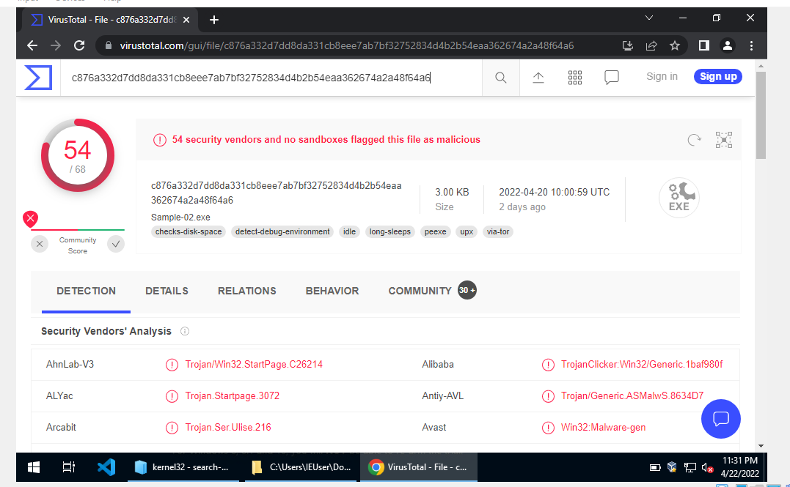

### 2. Are there any indications that this file is packed or obfuscated? If so, what are these indicators? If the file is packed, unpack it if possible.

Using PeiD, We can see that upx is packing the executable.

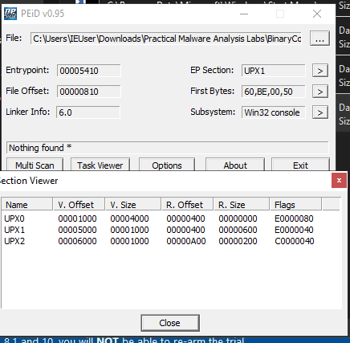

We can use back UPX to unpack the file.

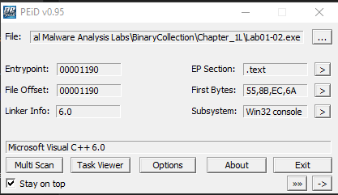

### 3. Do any imports hint at this program's functionality? If so, which imports are they and what do they tell you?

The program seems to be importing functions from Kernel32.dll to create a mutex for the program, which are normally used by alot of malware. The program also seems to be using threading in the program. 

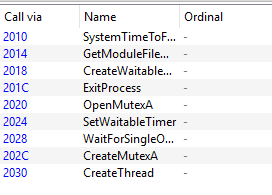

Next, the program also imports functions from ADVAPI32.dll. This library contains functions that support security and registry calls. The imported functions seem to be creating service(s) for the program. 

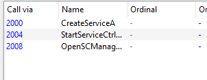

Then, the program also imports functions from WININET.dll to use the HTTP protocol to access the internet resources.

### 4. What host- or network-based indicators could be used to identify this malware on infected machines?

Using the strings utilities, some rather interesting strings are found.

We can see that there are some names that the program uses. "MalService", "malservice", "HGL34", might be the name used in Mutex or the service of the malware. There's also a URL that we could use as an IOC to detect malicious program activity in our network.

### Reverse engineering lab01-02 
Using Ghidra, I performed a simple analysis of the program. I found that "Malservice" is used as the service name of the program when executed.

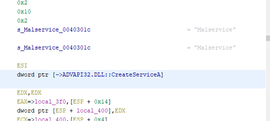

While a bit above the code, we can see that "HGL345" is used as the Mutex name for the program.

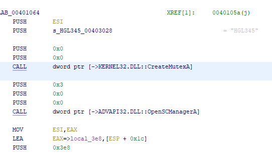

## Lab 01-03

### 1. Upload the Lab01-03.exe file to http://www.VirusTotal.com/. Does it match any existing antivirus definitions?

Yup, matched.

### 2. Are there any indications that this file is packed or obfuscated? If so, what are these indicators? If the file is packed, unpack it if possible.

Using PEiD again, it's rather apparent that the file is packed. The entry point and the file offset are different, and the compiler shown for the file is "FSG 1.0 -> dulek/xt". Not to mention, the program only imports two functions.

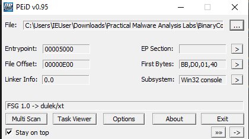

Not sure what that is but after some research and some attempts to unpack the program manually, nothing was working, so I decided to leave it for now. I have tried to find the real entry point to the program, but I just cannot find its address. I will definitely unpack this in the future. 

### 3. Do any imports hint at this program's functionality? If so, which imports are they and what do they tell you?

From the looks of the imports, when the program is packed, it is hard to tell what functionality it will perform after execution. 

### 4. What host- or network-based indicators could be used to identify this  malware on infected machines?

Unfortunately, no IOC could be found if the program is packed.

## lab01-04

### 1. Upload the Lab01-04.exe file to http://www.VirusTotal.com/. Does it match any existing antivirus definitions?

Yup, like the previous files, it is flagged by VirusTotal engine

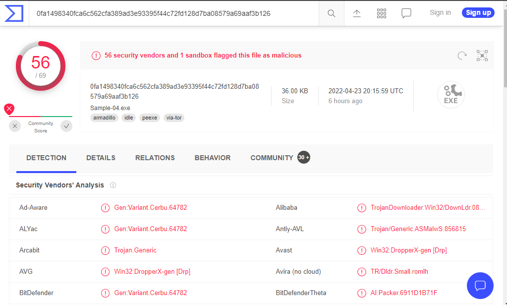

### 2. Are there any indications that this file is packed or obfuscated? If so, what are these indicators? If the file is packed, unpack it if possible.

Using PEiD the program doesn't seems to be packed

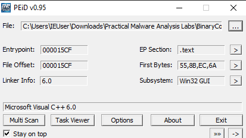

### 3. When was this program compiled?

Using PE-Bear the program seems to be compiled on 30/8/19 

### 4. Do any imports hint at this program’s functionality? If so, which imports are they and what do they tell you?

Using PE-Bear the program seems to be compiled on 30/8/19 

