# Lab 3

## Lab 03-01

### 1. What are this malware’s imports and strings?

The binary seems to be packed as viewed in PE-bear. Then using PEiD it seems that the binary is packed with a tool called PEncrypt. When viewed with PE-Bear, there seems to be one import only. But after executing the binary, more imports can be viewed using the process hacker.

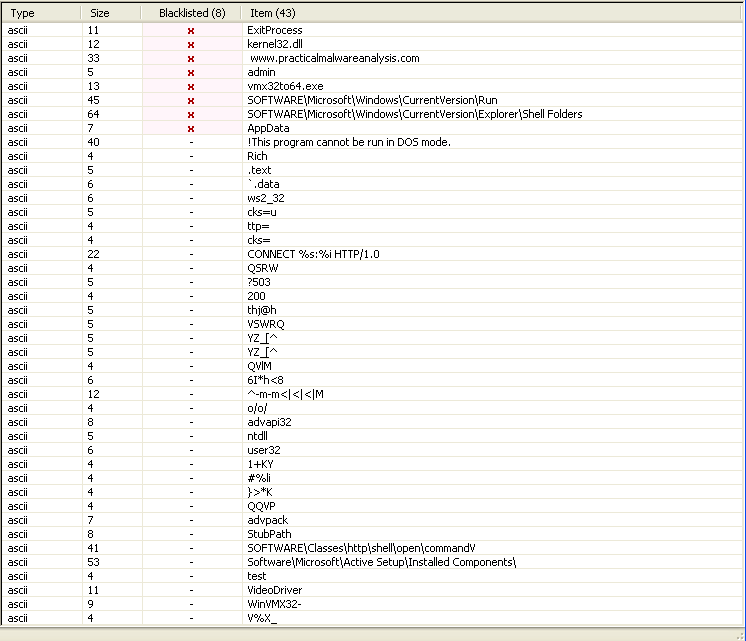

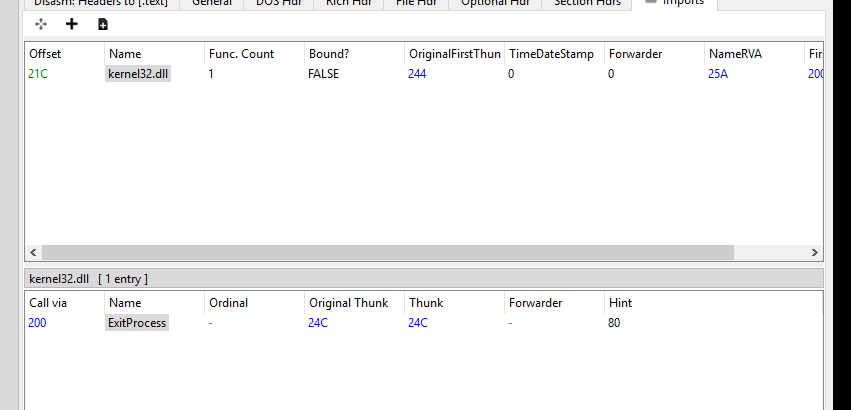

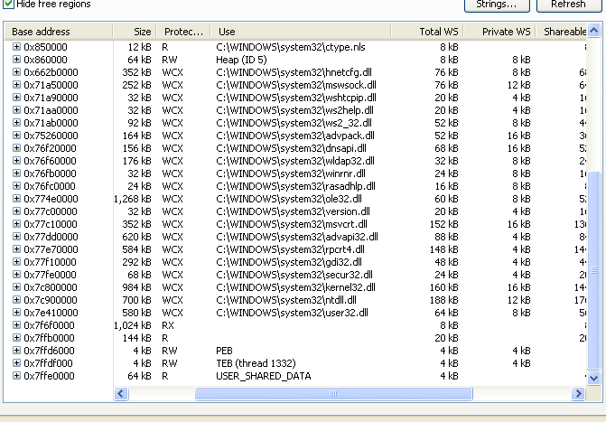

### 2. What are the malware’s host-based indicators?

There is three host based IOC that could be used to detect the malware activity. The malware would create a mutex named WinVMX32. It would also add a value into the HKLM\SOFTWARE\Microsoft\Windows\CurrentVersion\Run registry with the key named VideoDriver.  

### 3. Are there any useful network-based signatures for this malware? If so, what are they?

The malware seems to be requesting DNS request from www.practicalmalwareanalysis.com from the DNS server and trying to request pages from the URL.

## Lab 03-02

### 1. How can you get this malware to install itself?

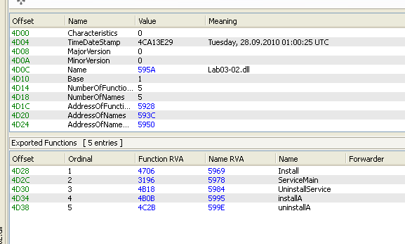

Viewing the exports of the dll file, we can see that there's a function called installA. We could install the malware using that function. The function will create a new service called IPRIP (based on the notification shown by window xp). 

### 2. How would you get this malware to run after installation?

To run the installed malware, we need to execute the command net start IPRIP to start the service

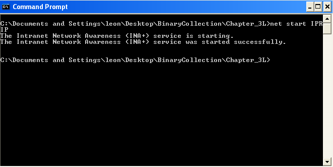

### 3. How can you find the process under which this malware is running?

To identify where is the malware running at (the process that it is running in), we can use process hacker and identify the PID of the service. Using that PID, we can identify the process that's running the malware. In this case, the malware is executing under one of the svchost.exe process. 

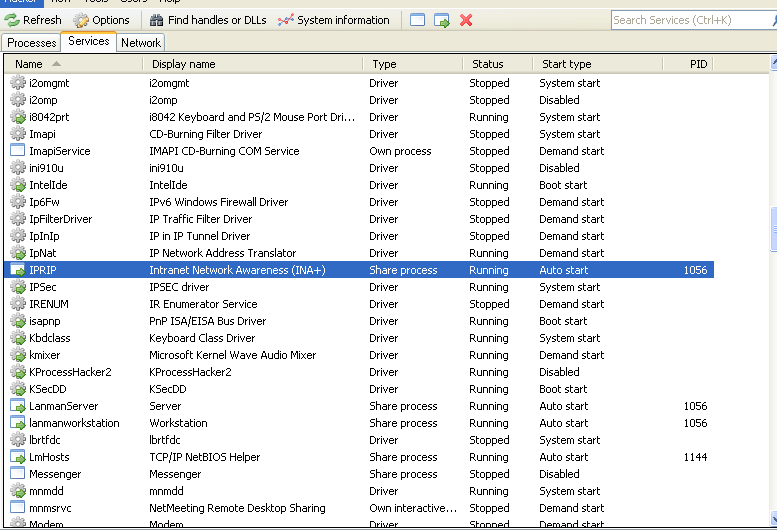

When clicking into the process, we can see that lab03-02.dll is loaded as one of the module used by the process. 

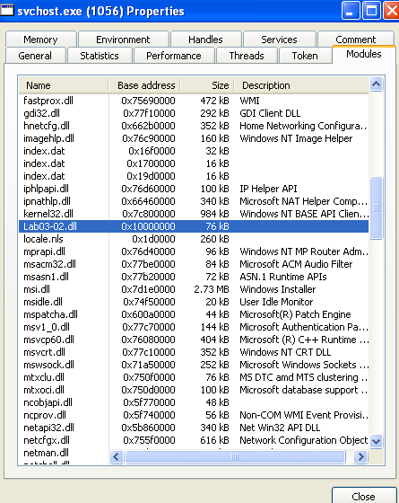

### 4. Which filters could you set in order to use procmon to glean information?

We can get all the information of the malware using the PID the malware module is running in.

### 5. What are the malware’s host-based indicators?

This malware has a display name of "Intranet Network Awareness (INA+)", service name "IPRIP", and the description of the module. The malware will also add a new key entry at "HKLM\SYSTEM\CurrentControlSet\Services\IPRIP\Parameters\ServiceDll: {The path to the dll}". These can be used as Host-based indicator. 

### 6. Are there any useful network-based signatures for this malware?

For network-based signature, the malware seems to be requesting HTTP requests to a domain name "http://practicalmalwareanalysis.com". It seems to be requesting a page named service.html, which returned HTTP response code 404 which means the server can't find the page.

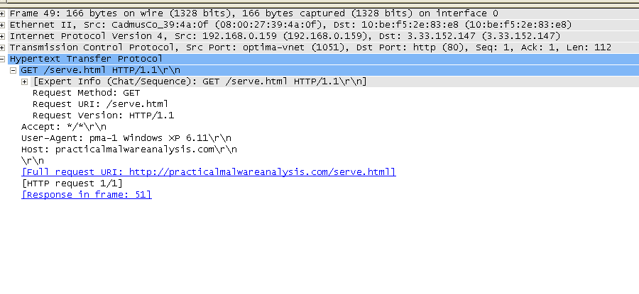

## Lab 03-03

### 1. What do you notice when monitoring this malware with Process Explorer?

When the binary was executed, the process created a svchost.exe process under it. But right after that the binary terminated itself. However, the spawned svchost.exe process did not get terminated along with it. 

### 2. Can you identify any live memory modifications?

Looking into a svchost.exe that was already on the sytem before the malware was executed, there were many strings contained in the process. However, the spawned svchost process contains less strings and contains many readable strings that induce suspicious towards them. 

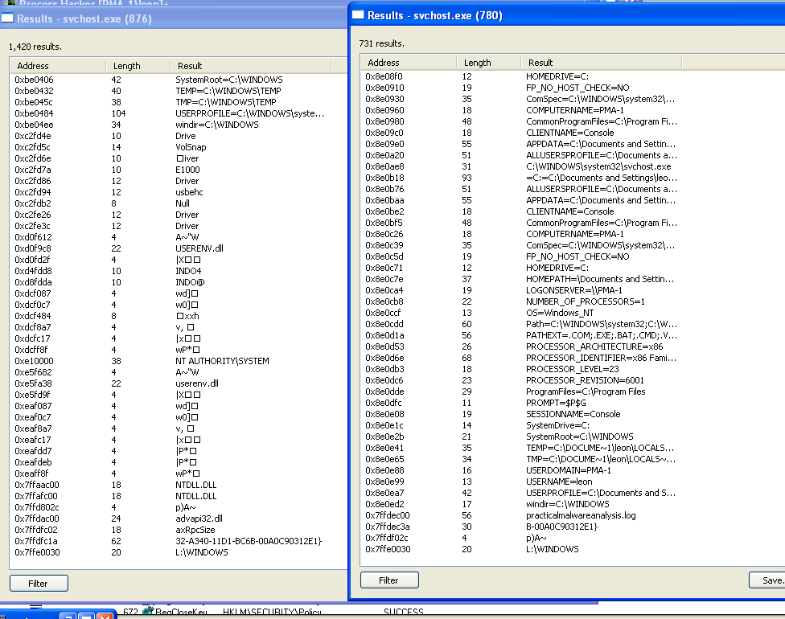

Not to mention, the suspicious strings of keyboard symbols contained in the strings of the process. This is an indicator that the malware is a keylogger and these strings are used in conditional operation of the keylogger to records keystrokes.

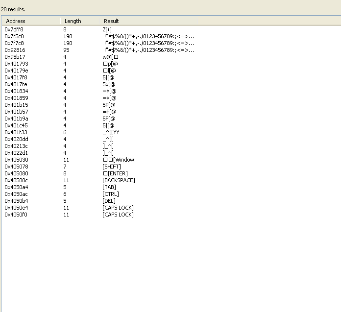

### 3. What are the malware’s host-based indicators?

The most obvious Host-based indicator of the malware is the file "practicalmalwareanalysis.log", that was used to store the recorded keystroke, performed by the keylogger. To further prove this claim, entries in the Procmon is filtered and we can see that there's data written into the file and also by looking into the file, we can see the keystroke we pressed before. 

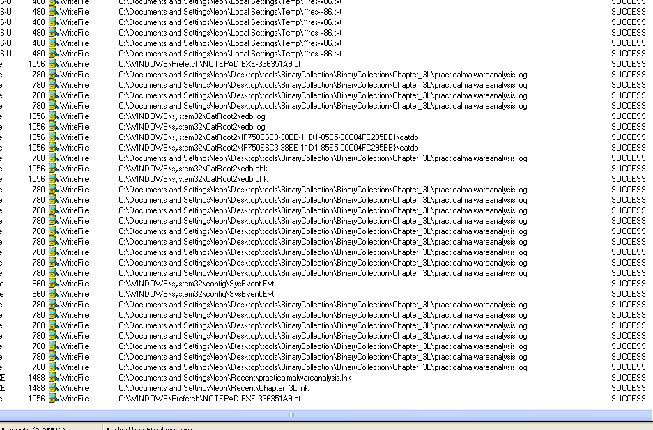

### 4. What is the purpose of this program?

This malware is a keylogger and it would perform process replacement onto the svchost.exe process that's spawned from the execution of the malware.