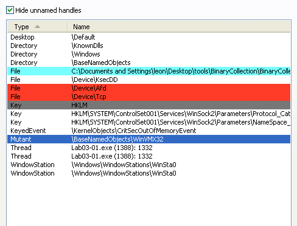
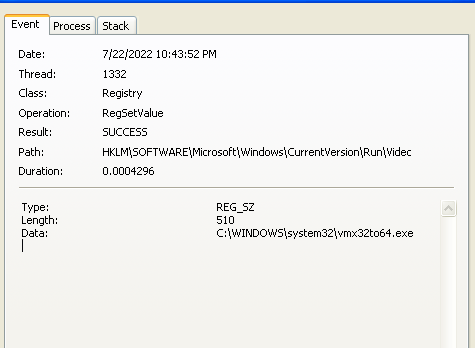

# Lab 3

## Lab 03-01

### 1. What are this malware’s imports and strings?

The binary seems to be packed as viewed in PE-bear. Then using PEiD it seems that the binary is packed with a tool called PEncrypt. When viewed with PE-Bear, there seems to be one import only. But after executing the binary, more imports can be viewed using the process hacker.

### 2. What are the malware’s host-based indicators?

There is three host based IOC that could be used to detect the malware activity. The malware would create a mutex named WinVMX32. It would also change the value of the HKLM\SOFTWARE\Microsoft\Windows\CurrentVersion\Run registry and  the VideoDriver registry in HKLM\SOFTWARE\Microsoft\Windows\CurrentVersion\Run\VideoDriver.  

### 3. Are there any useful network-based signatures for this malware? If so, what are they?

The malware seems to be requesting DNS request from www.practicalmalwareanalysis.com from the DNS server and trying to request pages from the URL.

