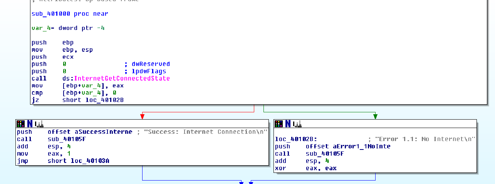
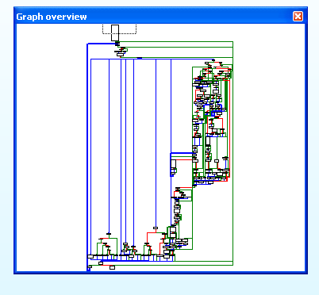
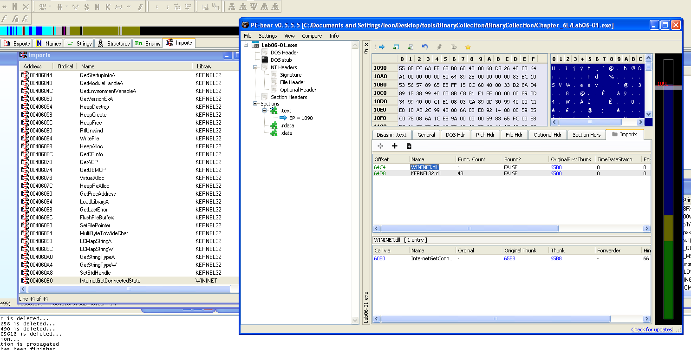

# Lab 6

## Lab 06-01

### 1. What is the major code construct found in the only subroutine called by main?

We can locate the primary code construct at 0x401000 of the program.

 

### 2. What is the subroutine located at 0x40105F?

Looking into the code at sub_40105F, we will quickly find ourselves in a rabbit hole where the proceeding code found is unending. Most of the time, the endless rabbit holes imply that the subroutine is a function from the standard library. One hint that stands out is that every time before calling the subroutine, the program would push a String onto the stack. Most of the time, the usage of Strings in programs is to print out a text to the stdout. Not to mention, the String also contains a message which is meant for a user. All of these show that the subroutine is probably the printf function from the stdio library. 

 

### 3. What is the purpose of this program?

The program imports the InternetGetConnectedState function from WININET.dll and checks if there's an internet connection on the machine. According to its documentation on the Windows page [^1], we can see that the function will return True if there is an active LAN/modem internet connection and False otherwise. In assembly False would be 0 while, True would be 1. In the code at sub_40105F, we can see that after the InternetGetConnectedState function call, the program would compare the EAX value with 0. Next, the JZ (jump zero) instruction would redirect the program to sub_40102B if InternetGetConnectedState returns False(0). Since 0 cmp 0 would not set the Zero flag. Then, continue at 0x401017 if that is not the case. Both routes would print out the status of the internet connection respectively.  

 

[^1]: https://learn.microsoft.com/en-us/windows/win32/api/wininet/nf-wininet-internetgetconnectedstate