# Lab 6

## Lab 06-01

### 1. What is the major code construct found in the only subroutine called by main?

We can locate the primary code construct at 0x401000 of the program.

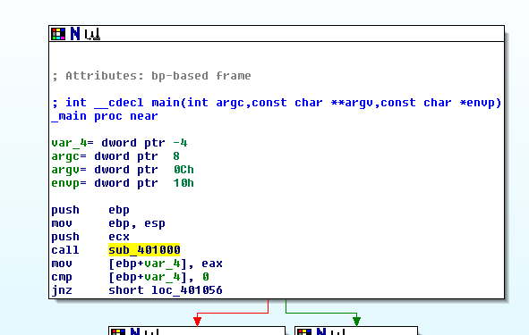

 

### 2. What is the subroutine located at 0x40105F?

Looking into the code at sub_40105F, we will quickly find ourselves in a rabbit hole where the proceeding code found is unending. Most of the time, the endless rabbit holes imply that the subroutine is a function from the standard library. One hint that stands out is that every time before calling the subroutine, the program would push a String onto the stack. Most of the time, the usage of Strings in programs is to print out a text to the stdout. Not to mention, the String also contains a message which is meant for a user. All of these show that the subroutine is probably the printf function from the stdio library. 

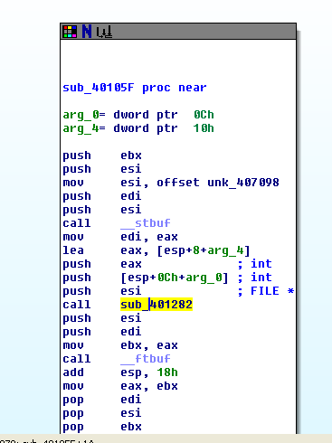

 

### 3. What is the purpose of this program?

The program imports the InternetGetConnectedState function from WININET.dll and checks if there's an internet connection on the machine. According to its documentation on the Windows page [^1], we can see that the function will return True if there is an active LAN/modem internet connection and False otherwise. In assembly False would be 0 while, True would be 1. In the code at sub_40105F, we can see that after the InternetGetConnectedState function call, the program would compare the EAX value with 0. Next, the JZ (jump zero) instruction would redirect the program to sub_40102B if InternetGetConnectedState returns False(0). Since 0 cmp 0 would set the Zero flag. The program continue at 0x401017 if that is not the case. Both routes would print out the status of the internet connection respectively.  

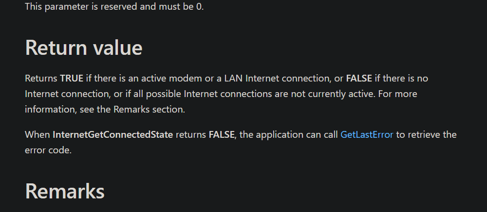

 

## Lab 06-02

### 1. What operation does the first subroutine called by main  perform?

The subroutine found at 0x401000 is about the same as the previous one in lab06-1. The subroutine performs a check for internet connection using an if statement. 

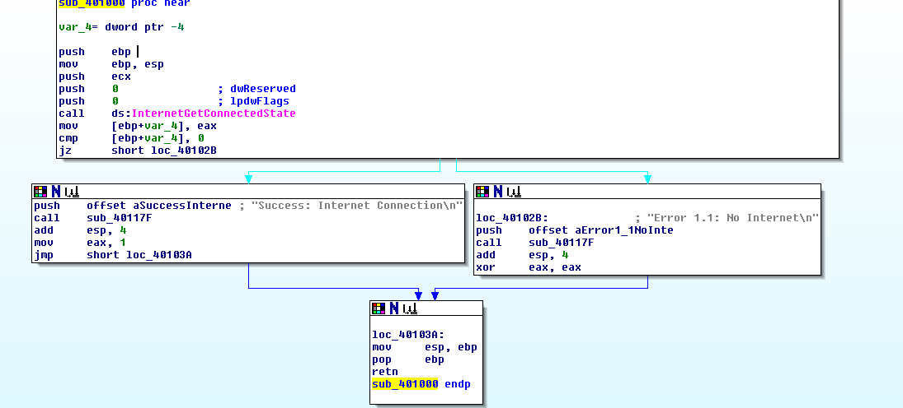

 

### 2. What is the subroutine located at 0x40117F?

Just like the previous binary, the subroutine located at 0x40117F is most probably a printf function.

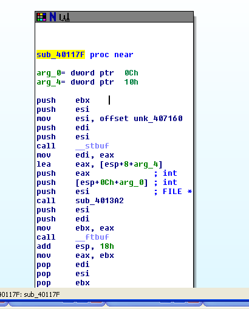

 

### 3. What does the second subroutine called by main do?

The second subroutine called by the main function is the subroutine sub_401040.

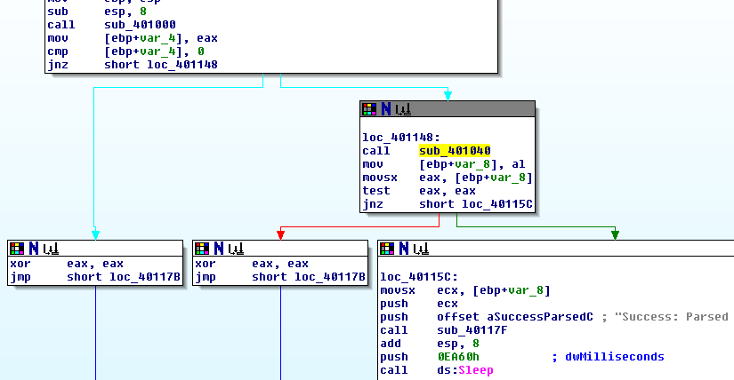

 

### 4. What type of code construct is used in this subroutine?

This code construct seems to be using InternetOpenA[^2] function to initialize WinINet's function. Then the program would download the resource specified by an URL using InternetOpenUrlA[^3]. The program seems to be trying to reach a page at http[://]www[.]practicalmalwareanalysis[.]com/cc[.]htm. We can also see that there's another string "Internet Explorer 7.5/pma" which seems to be used as the user-agent for the URL request. The result of the function call will be stored in a local variable called hfile. The hfile variable is then compared with 0. If hfile value was null previously (the program did not successfully download the resource from the URL), the cmp instruction will result in the zero flag being 1. Because the two values are the same, which triggers the zero flag set to 1. This would not trigger the next instruction which is the JNZ and instead print out the message "Error 2.1: Fail to OpenUrl". Then, close the internet handle using InternetCloseHandle [^4].

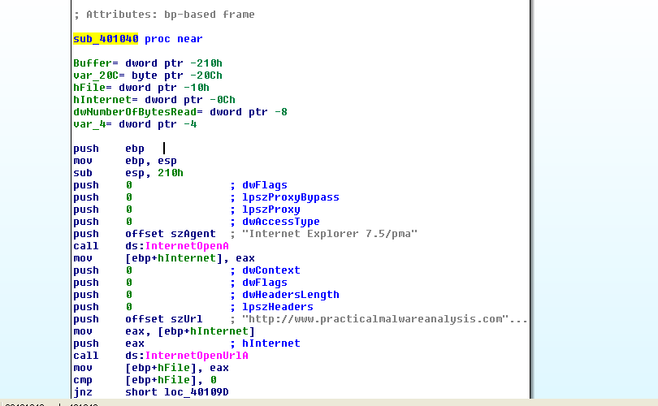

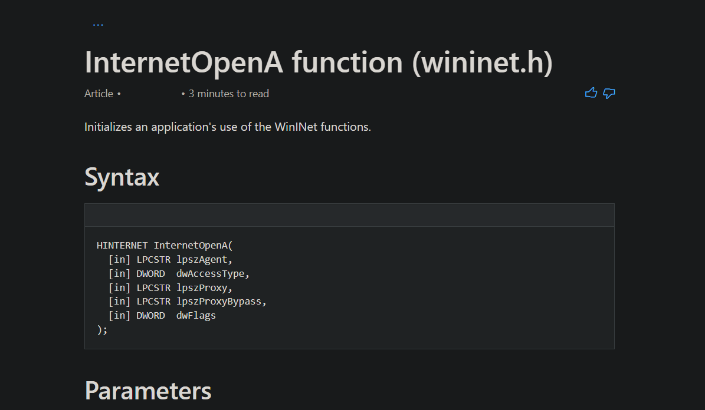

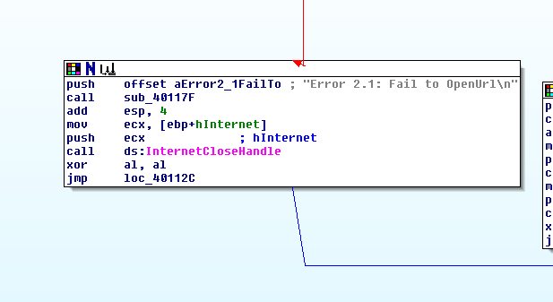

If the web page was successfully accessed by the program, the program will next read the data retrieved from the web page using InternetReadFile[^5]. The function would either return True if the data can be read by InternetReadFile, or False otherwise. If the result returned is False, it would use printf to print out "Error 2.2: Fail to ReadFile" and close both handles from InternetOpenA and InternetOpenUrlA. One more thing to note is that the InternetReadFile function is fed with a buffer with a size of 200h or 512 bytes.

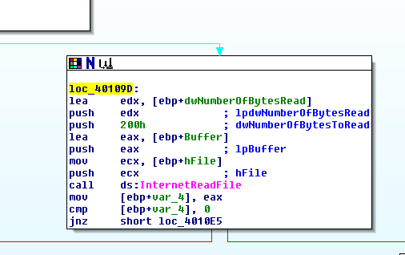

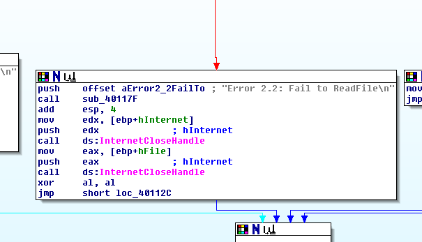

If InternetReadFile returned True (the operation was successful), the program seems to be performing cmp operation for the first 4 bytes of the data that was stored in the buffer, containing the data of the page request. When converting the bytes into ASCII characters, we can see that they represent the string "&lt;!-- " which is the header of an HTML comment. Since the buffer represents the start of the data, the comparisons will only compare the first 4 characters of the data. If any of the comparisons cause the Zero flag to be not 0, the program would jump to loc_40111D. Which will print out the message "Error 2.3: Fail to get command". No matter the bytes comparisons results in, the handles do not seem to be closed afterwards.

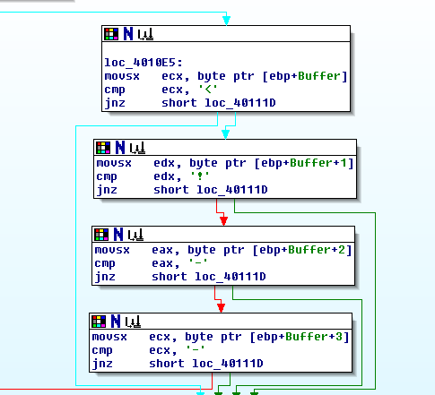

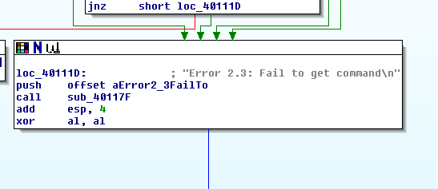

Once, all the comparisons was done and all of the characters match, the character after the first 4 bytes character will be returned by the function to main. IDA seems to have failed to recognize that the program is referring to the 5th character of the buffer array and labelled it as var_20C instead. To fix this issue we can press ctrl+k to open up the stack frame window and change the struct of the buffer to an array with the size of 512. After that, we can see that IDA would successfully recognize that var_20C is Buffer+4. The 5th character will be moved into al and returned from this function. 

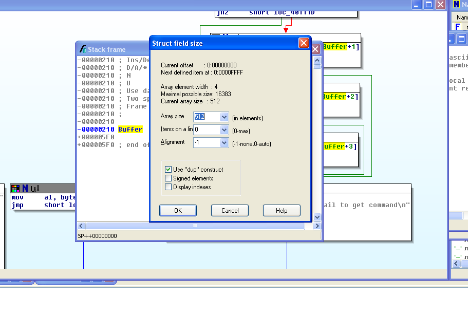

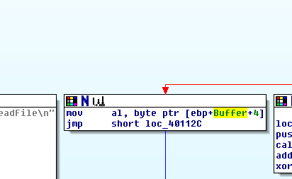

Going back to the main function, we can see that after returning the al value from the subroutine call, if the value is a non-zero value, a message "Success: Parsed command is A" where A is whatever character found at the 5th character of the HTML comment. After that, the program will sleep for 60,000  milliseconds using the Sleep function[^6].

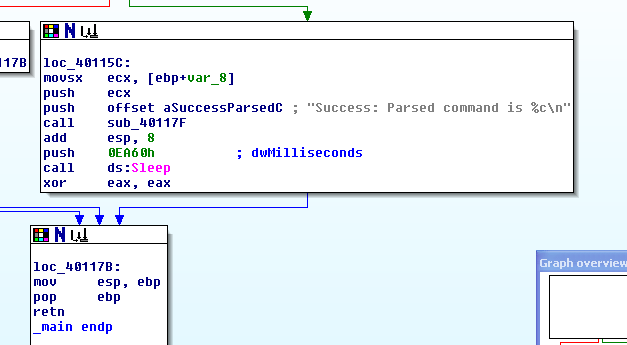

 

### 5. Are there any network-based indicators for this program?

There are two network-based indicators .The user-agent "Internet Explorer 7.5/pma" and the URL opened by the program "http[://]www[.]practicalmalwareanalysis[.]com/cc[.]htm"

 

### 6. What is the purpose of this malware?

To summarize the analysis in question 4, the program will first check for an internet connection, and then download the page from http[://]www[.]practicalmalwareanalysis[.]com/cc[.]htm. Which contains the comment string "&lt;!--" at the start. This technique is normally used by attackers to send commands to their malware while hiding the command in the HTML page because the comment is not shown on the webpage (but is visible on the source page). This will make the program disguised as if it's going to a normal web page. 

 

[^1]: https://learn.microsoft.com/en-us/windows/win32/api/wininet/nf-wininet-internetgetconnectedstate
[^2]: https://learn.microsoft.com/en-us/windows/win32/api/wininet/nf-wininet-internetopena
[^3]: https://learn.microsoft.com/en-us/windows/win32/api/wininet/nf-wininet-internetopenurla
[^4]: https://learn.microsoft.com/en-us/windows/win32/api/wininet/nf-wininet-internetclosehandle
[^5]: https://learn.microsoft.com/en-us/windows/win32/api/wininet/nf-wininet-internetreadfile
[^6]: https://learn.microsoft.com/en-us/windows/win32/api/synchapi/nf-synchapi-sleep